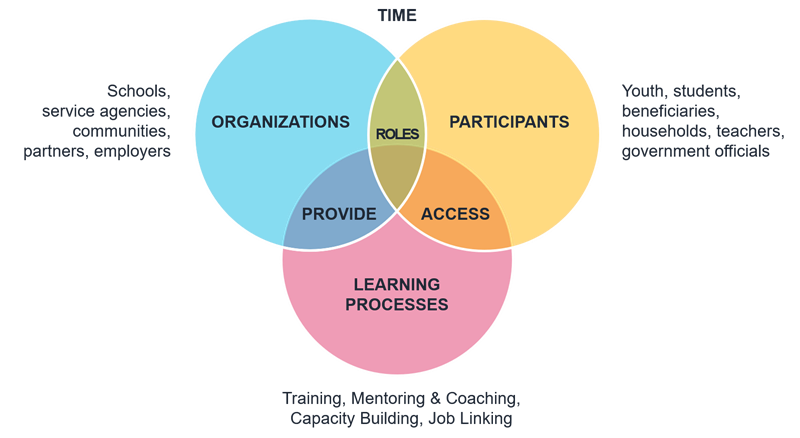

<p align="center"></p>

M&E Insight is a monitoring and evaluation data management system for international development projects

Demo: https://meinsight.edc.org

# Background
International development projects are often challenged with managing large amounts of data and information across multiple partners and programs. EDC created **M&E Insight** to streamline the data management process. Developed by programmers who understand the data collection, tracking, and reporting needs of the field, the system works for initiatives of all types and sizes.

Designed to Meet the Challenges of International Development Programs

EDC works in all 50 U.S. states and in 22 countries around the world. We’ve learned that development initiatives share common elements and challenges regarding data management. That’s why we designed M&E Insight to meet the Common Education Data Standards (CEDS). Our adherence to the standards provides a common data vocabulary for every project, including a common set of data elements (e.g., participant types) that can be improved, reused, and replicated for any project.

")

## What is M&E Insight?
M&E Insight is an ASP.NET Core MVC Web Application, built using .NET Core v2.2 framework and the MVC architectural pattern (Model-View-Controller) for its front-end interface. For the back-end, M&E Insight uses Entity Framework (EF) Core with the Code-First approach as the data access layer with a Microsoft SQL Server database.

The **data model** supports organizations and their relationships with other organizations, participants, learning processes and time. Based on the [CEDS](https://ceds.ed.gov/dataModel.aspx) conceptual model:

  

With this model, you can create a flexible hierarchy of organizations that may have multiple parent-child relationships with each other (i.e. Province -> District -> Schools). Participants are unique to one organization and can be enrolled into one or many learning processes, tracking their program attendance and assessment scores.

M&E Insight is currently available in English, Spanish, and French, but new translations can be easily added.

Other features:
*  Role based access using ASP.NET Core Identity
*  Soft delete -records are not deleted from the database, instead a flag (IsDeleted) is marked on the specific record.

# Getting started

## Development/Testing environment prerequisites
Download and install the following tools to setup your local development/testing environment:
* [Visual Studio Community 2019](https://visualstudio.microsoft.com/vs/community/), with the following workloads installed:
  * ASP.NET and web development
  * .NET Core cross-platform development
  * .NET Core 2.2 development tools (option selected separately)
    
   Recommended Visual Studio Extensions:
    * [Web Essentials 2019](https://marketplace.visualstudio.com/items?itemName=MadsKristensen.WebEssentials2019) (Bundler & Minifier, Web Compiler)
    * [CSS AutoPrefixer](https://marketplace.visualstudio.com/items?itemName=MadsKristensen.CSSAutoPrefixer) (Auto-prefix Bootstrap SCSS)
    * [ResXManager](https://marketplace.visualstudio.com/items?itemName=TomEnglert.ResXManager) (for localizing translations)

* [Microsoft SQL Server Express edition](https://www.microsoft.com/en-us/sql-server/sql-server-editions-express)
* [Microsoft SQL Server Management Studio (SSMS)](https://docs.microsoft.com/en-us/sql/ssms/download-sql-server-management-studio-ssms?view=sql-server-2017) or [Azure Data Studio](https://docs.microsoft.com/en-us/sql/azure-data-studio/download?view=sql-server-2017) 

### Running M&E Insight
1. Open the .sln solution file in Visual Studio Community 2019.
2. (optional) Edit the `appsettings.json` and update the `DefaultConnection` string to match your environment (if left unmodified, by default it will automatically create a `localdb` database named `MEInsight`): 
    ```json 
    {
        "Logging": {
            "LogLevel": {
            "Default": "Warning"
            }
        },
        "AllowedHosts": "*",
        "ConnectionStrings": {
            "DefaultConnection": "Server=(localdb)\\mssqllocaldb;Database=MEInsight;Trusted_Connection=True;MultipleActiveResultSets=true"
        }
    } 

    ```
3. Build the solution, start debugging and test drive M&E Insight.

## Documentation
* Setup guide (coming soon)
* Users guide (coming soon)


# License
[](LICENSE)

This program is free software: you can redistribute it and/or modify it under the terms of the GNU Affero General Public License as published by the Free Software Foundation, either version 3 of the License, or (at your option) any later version.

This program is distributed in the hope that it will be useful, but WITHOUT ANY WARRANTY; without even the implied warranty of MERCHANTABILITY or FITNESS FOR A PARTICULAR PURPOSE. See the GNU Affero General Public License for more details.

You should have received a copy of the GNU Affero General Public License along with this program. If not, see <https://www.gnu.org/licenses/>.


Copyright (C) 2019 Education Development Center, Inc.

---

</p>
Education Development Center (EDC) is a global nonprofit that advances lasting solutions to improve education, promote health, and expand economic opportunity. Since 1958, we have been a leader in designing, implementing, and evaluating powerful and innovative programs in more than 80 countries around the world.

EDC 43 Foundry Avenue Waltham, MA 02453
E-mail: meinsight@edc.org
Phone: 617-969-7100


